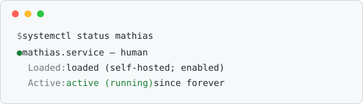

### Mathias

I build things that are supposed to just run — servers, containers, small automations.

Most of it is self-hosted and lives off GitHub.

<picture>
  <source media="(prefers-color-scheme: dark)" srcset="assets/status-dark.svg">
  
</picture>

This profile is intentionally minimal. Mostly.
