<div align="center">

<!-- Header -->


<!-- Typing SVG -->
<a href="https://git.io/typing-svg">
  
</a>

</div>

<!-- About -->
### 👋 About Me

```yaml
name: Mathias
location: Germany 🇩🇪
focus: Web Development & Automation
currently_building: pegasus-website
interests: ["e-commerce", "workflow automation", "clean UI"]
```

<!-- Tech Stack -->
### ⚡ Tech Stack

<div align="center">


</div>

<!-- GitHub Stats -->
### 📊 Stats

<div align="center">



</div>


<div align="center">
  
</div>

<!-- Snake Animation -->
### 🐍 Contribution Graph

<div align="center">
  <picture>
    <source media="(prefers-color-scheme: dark)" srcset="https://raw.githubusercontent.com/Avee4k/Avee4k/output/github-snake-dark.svg" />
    
  </picture>
</div>

<!-- Footer -->
<div align="center">
  
</div>


